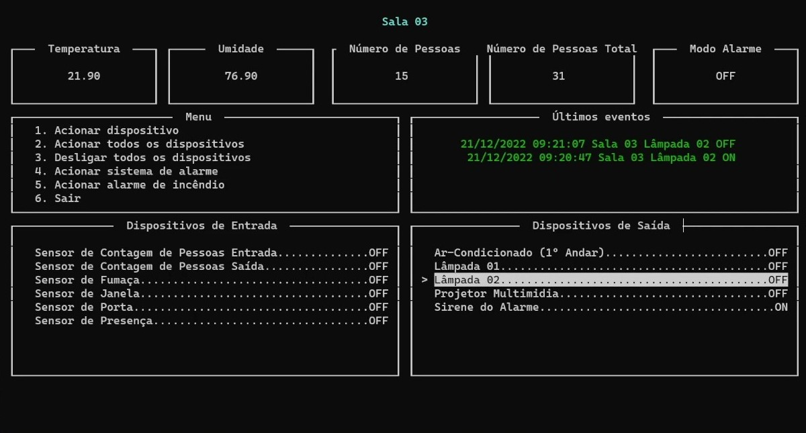
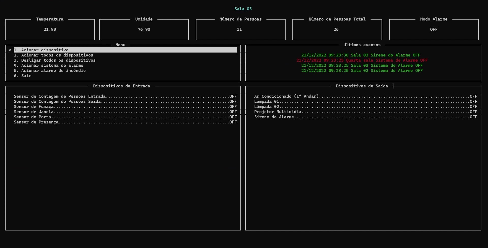

# Trabalho 1 - Fundamentos de Sistemas Embarcados

## Especificação

Automação predial ...

## Instalação

### Servidor Central

São utilizadas apenas módulos _builtin_ de python, logo não é necessário instalar dependências via `pip`.

A única configuração necessária a ser feita no Servidor Central é no arquivo `src/central/config.json`. Onde é necessário alterar os seguintes campos:

- ip: IP pelo qual esse **Servidor Central** ficará disponível para receber requisições. (Pode ser deixado como 0.0.0.0)
- port: Porta pelo qual esse **Servidor Central** ficará disponível para receber requisições.
- log_file: Caminho do arquivo que será utilizado para para escrever os _logs_ dos comandos solicitados pelo usuário. (Opcional)
- rooms: Lista das salas que o **Servidor Central** se comunicará para enviar os comados.
    - name: Nome da sala que será apresentado no **Servidor Central**. É recomendado colocar um nome único para melhor identificação da sala.
    - ip: IP que será usado para se comunicar com o **Servidor Distribuído** que está instalado nesta sala.
    - port: Porta que será usada para se comunicar com o **Servidor Distribuído** que está instalado nesta sala.

### Servidor Distribuído

Esse passo é opcional, mas recomendado. Primeiro vamos criar um ambiente virtual para instalar as dependências do projeto.

```bash
# Criando um ambiente virtual com nome `venv`
python3 -m venv venv
# Ativando o ambiente virtual
source venv/bin/activate
```

Agora vamos instalar as bibliotecas necessárias para rodar o projeto.

```bash
# Atualizando o pip
pip3 install -U pip

# Instalando bibliotecas
pip3 install -r requirements.txt
```

Por fim precisamos configurar o arquivo `src/distribuido/config.json`. Nesse arquivo precisamos alterar os seguintes campos:

- ip_servidor_central: IP que será usado para se comunicar com o **Servidor Central** via socket
- porta_servidor_central: Porta que será usada para se comunicar com o **Servidor Central** via socket
- ip_servidor_distribuido: IP pelo qual esse **Servidor Distribuído** ficará disponível para receber requisições. (Pode ser deixado como 0.0.0.0)
- porta_servidor_distribuido: Porta pelo qual esse **Servidor Distribuído** ficará disponível para receber requisições
- inputs: Os campos `gpio` devem ser configurados de acordo com os pinos da *GPIO*
- ouputs: Os campos `gpio` devem ser configurados de acordo com os pinos da *GPIO*
- sensor_temperatura: Os campos `gpio` devem ser configurados de acordo com os pinos da *GPIO*

_**IMPORTANTE**_: O campo `tag` dos dispositivos _inputs_ e _outputs_ **não** deve ser alterado!!

## Como usar

Com o **Servidor Distribuído** e o **Servidor Central** configurados, deixe o **Servidor Distribuído** rodando em um terminal a parte e execute o **Servidor Central**.

### Interface

Para o uso adequado do **Servidor Central** é necessário tomar cuidado com o tamanho do terminal, pois a pesar das "caixinhas" da interface serem responsivas, caso não tenha espaço suficiente para mostrar todos os dados ele irá parar a execução.

Na **Figura 1** podemos ver a interface em um terminal com tamanho reduzido e com o menu de dispositivos de saída selecionado. Já na **Figura 2** temos um exemplo do terminal em modo tela cheia no menu principal da aplicação.


<h6 style="text-align:center">Figura 1: Menu de dispositivos - terminal pequeno</h6>


<h6 style="text-align:center">Figura 2: Menu principal - terminal tela cheia</h6>

Como podemos ver nas figuras acima, a interface apresenta algumas informações que são atualizadas a cada segundo, são elas:

- Temperatura: Temperatura atual da sala
- Umidade: Umidade atual da sala
- Número de Pessoas: Quantidade de pessoas que estão na sala no momento (Começa a contar quando o **Servidor Distribuído** entra em execução)
- Número de Pessoas Total: Somatório do _Número de Pessoas_ de todas as salas
- Modo Alarme: estado do Modo Alarme. Quando o Modo de Alarme está ativado a _Sirene do Alarme_ é acionada sempre que há detecção de presença na sala ou o sensor de janela ou o sensor de porta é acionado.
- Menu: Possíveis ações que o usuário pode realizar.
- Últimos eventos: Últimas 4 ações que o usuário solicitou da forma **DATA HORA SALA DISPOSITIVO VALOR**. Quando a mensagem está em verde significa que o comando da mensagem foi realizado com sucesso, quando está em vermelho significa que houve um erro na execução do comando.
- Dispositivos de Entrada: Estado de todos os sensores de entrada presentes na _GPIO_.
- Dispositivos de Saída: Estado de todos os sensores de saída presentes na _GPIO_.

### Navegação

Para navegar nos menus é possível utilizar as setinhas do teclado, ou as teclas `j` e `k` para navegar para baixo e para cima respectivamente. Para executar a ação que está selecionada aperte a tecla `Enter`. Para voltar para a primeira opção do _Menu_, seja da aba _Dispositivos de Saída_ ou do próprio _Menu_ aperte `Backspace`. A navegação entre salas é realizada através das teclas `Tab` e `Shift + Tab` para ir para a próxima sala e para a anterior respectivamente. Para sair do programa basta selecionar a opção _Sair_ ou apertar `Ctrl + c`.
